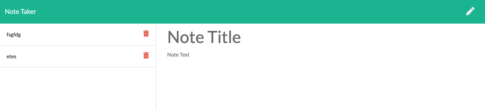
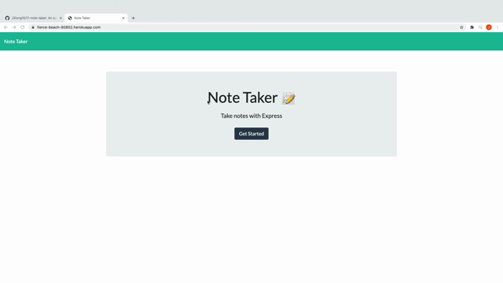

# 11 Express.js: Note Taker

## Table of Contents
* [Introduction](#introduction)
* [Functionality](#functionality)
* [Tasks Completed](#tasks-completed)
* [Technologies Used](#technologies-used)
* [Installations](#installations)
* [Demos](#demos)
* [Sources](#sources)
* [Known Bug](#known-bug)
* [License](#license)

 ## Introduction
 Uses Node, Express, and UUID to generate a Note Taking application. Users can create, save, and delete notes. The application is deployed on a Heroku live server.
 * GitHub Repository: https://github.com/JXIong15/11-note-taker
 * Link to Heroku App: https://fierce-beach-80852.herokuapp.com/

## Functionality
* When the user navigates to the home page, they can click on the sole "Get Started" button, which will take them to the note-taking page.
* By clicking on the "Note Taker" in white font in the upper left corner, the user is brought back to the home page.
* On the Notes page, saved notes are on the left-hand column. Clicking on the Title of the saved note displays the note's contents.
* Clicking on the red trash icon deletes the note.
* Clicking on the write pen icon in the top right corner allows the user to write a new note.
* When the user types in a title and note test, a white save disc icon appears next to the pen.
  * Clicking on the save icon saves the note to be displayed on the left hand column, and it clears the note-typing area for the user to write a new note.

## Tasks Completed
* Downloaded all dependencies needed: Express, Node, UUID.
* Created a server.js file to connect the front and back-end of the app.
* In the server.js file, set up the port, server, and API routes
* In the htmlRoutes.js file, created a path to route to the notes page.
  * created a path for Heroku to route to the homepage.
* In the apiRoutes.js file, which uses the "/notes" page:
  * used a GET command to display current saved notes from the db.json file
  * used a POST command to save the Title and Text of the new note to a newNote object.
    * used a UUID to create a unique ID, which is then assigned to the object's ID
    * pushes/adds this newNote to the db.json file's array, and the Saved column is updated to reflect the new note
  * used a DELETE command to call upon the ID of the note to be deleted (delID)
    * creates a new array of newNotes without the note with the delID
    * Saved Notes on the left column display the current notes once the deleted note is removed from the array
  * used fs to rewrite the db.json file with the new array for the POST and DELETE commands

## Installations
* Download [Node and npm](https://coding-boot-camp.github.io/full-stack/nodejs/how-to-install-nodejs)
* Then, download the UUID Package by typing, "npm install uuid" in command line
* Then, download the express package by typing, "npm install express" in the command line
* Download [Heroku](https://devcenter.heroku.com/categories/command-line)

## Technologies Used
* JavaScript (main code)
* HTML
* Node
  * UUID to generate random unique IDs for each note
  * Express to use a server and URL routes
* Txt File (License)
* JSON file to store the array of notes
* Heroku to deploy the live application

## Demos
   

## Sources
* UUID Package: https://www.npmjs.com/package/uuid
* Express Package: https://www.npmjs.com/package/express

## Known Bug
* After viewing a saved note, the user can click on the "pen" icon to write a new note. However, they are unable to write a new note after immediately viewing a saved note. The way to combat this is to refresh the page because all saved notes are saved to the local storage.

## License
Licensed under the [MIT License](LICENSE).

© 2021 Jou Xiong, Trilogy, Northwestern Coding Bootcamp
